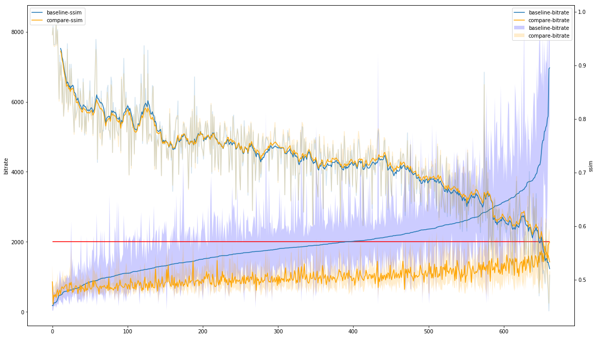

This repository is abandoned because this codes did not produce the expected results.

# エンコードしたビデオの品質評価を行う

hevc_nvencよりもx265-VBRの方が仕上がりがいいのではないかということを定量的に示したかった。

現状品質評価にはいくつかの指標が用いられている。

- MSE(Mean squared error, 平均二乗誤差): https://ja.wikipedia.org/wiki/%E4%BA%8C%E4%B9%97%E5%B9%B3%E5%9D%87%E5%B9%B3%E6%96%B9%E6%A0%B9
- PSNR(Peak signal to noise ratio, ピーク信号対雑音比): https://ja.wikipedia.org/wiki/%E3%83%94%E3%83%BC%E3%82%AF%E4%BF%A1%E5%8F%B7%E5%AF%BE%E9%9B%91%E9%9F%B3%E6%AF%94
- SSIM(Structural similarity index): https://en.wikipedia.org/wiki/Structural_similarity
- VMAF(Video Multimethod Assessment Fusion): https://en.wikipedia.org/wiki/Video_Multimethod_Assessment_Fusion, https://medium.com/netflix-techblog/toward-a-practical-perceptual-video-quality-metric-653f208b9652

MSEとPSNRはほぼ元ソース画像とエンコード後の画像の差分に応じて悪化する。ただ、コンテンツの種類によっては悪化が目立つ場合と目立たない場合がある。以下の例は2つのコンテンツで同程度の劣化が生じた場合のもの。群衆の映像ではそれほど劣化が目立たないのに対して、右側のアニメーションの画像では劣化が目立っている。

Netflixのブログでは、MSE, PSNRだけではなく、SSIMにおいても類似の傾向が見られると言っている。

# このプロジェクトでやりたかったこと

元の映像に近い高画質の映像を得ることが目的ではなくて、ある程度の満足ができる映像(x265, 2000kbps, 2passVBR)をベースラインとして、他のエンコード方法でエンコードした動画がベースラインの映像に対してどの程度変化しているかを定量的に把握したかった。

以下は2つの映像を比較した時のもの

[比較対象]
1. 元映像: mpeg2, 17690kbps
1. ベースライン: x265, 2000kbps, 2passVBR, maxbitrate=7500k
1. 比較対象: hevc_nvenc, preset=slow, 1000k

元映像-ベースラインの差異を"baseline(青色)", 元映像-比較対象の差異を"compare(オレンジ)"で描画している。期待値としてはオレンジの線が青色より低下することだったが・・・

